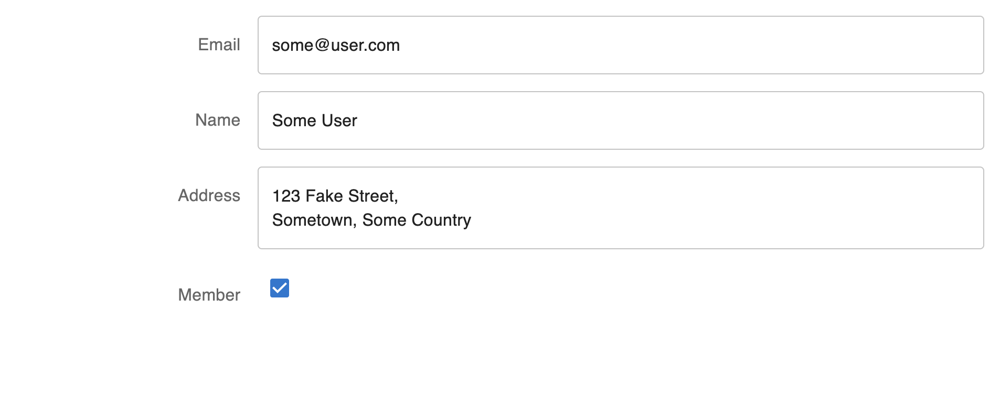
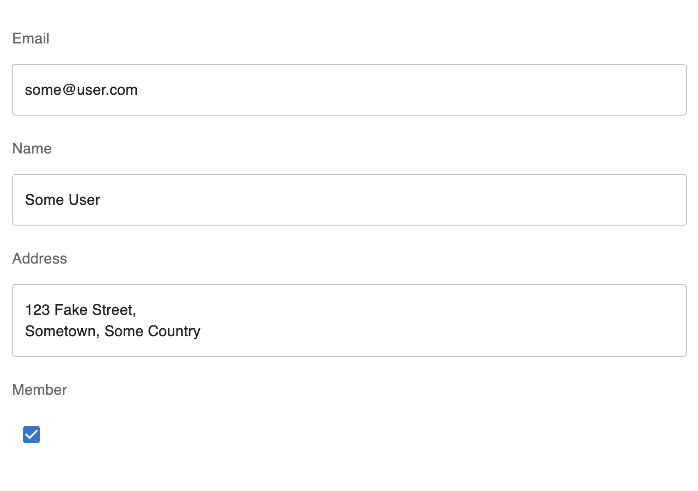
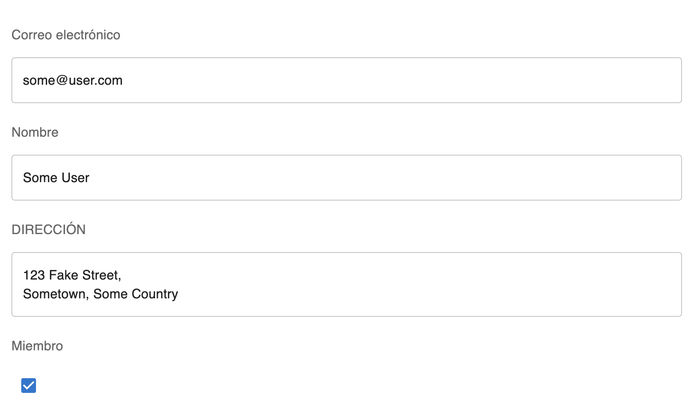
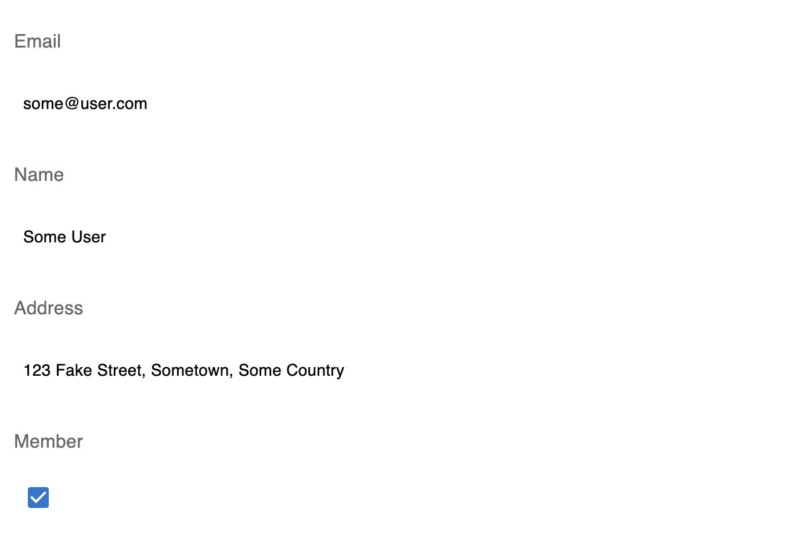
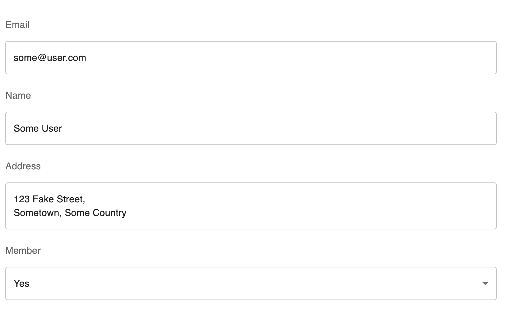
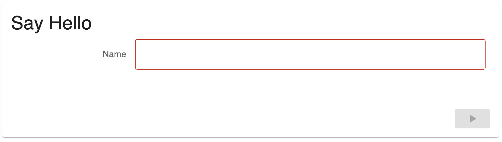
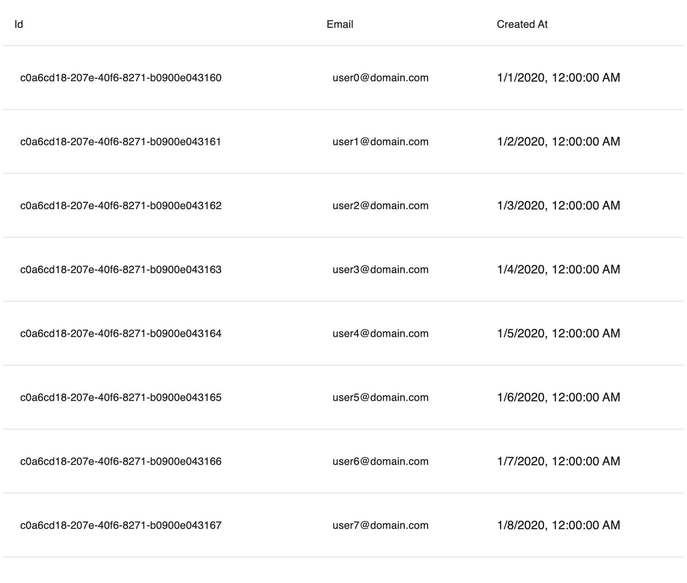
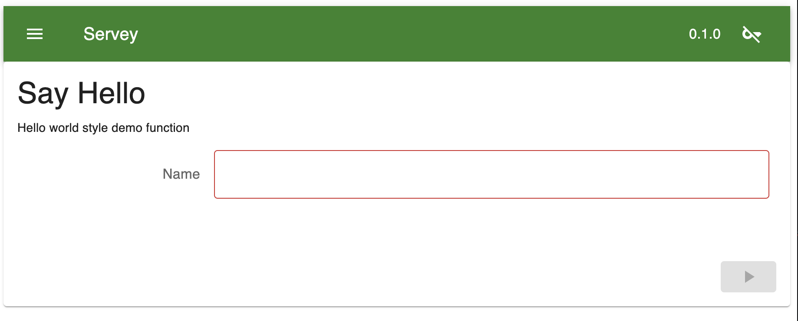
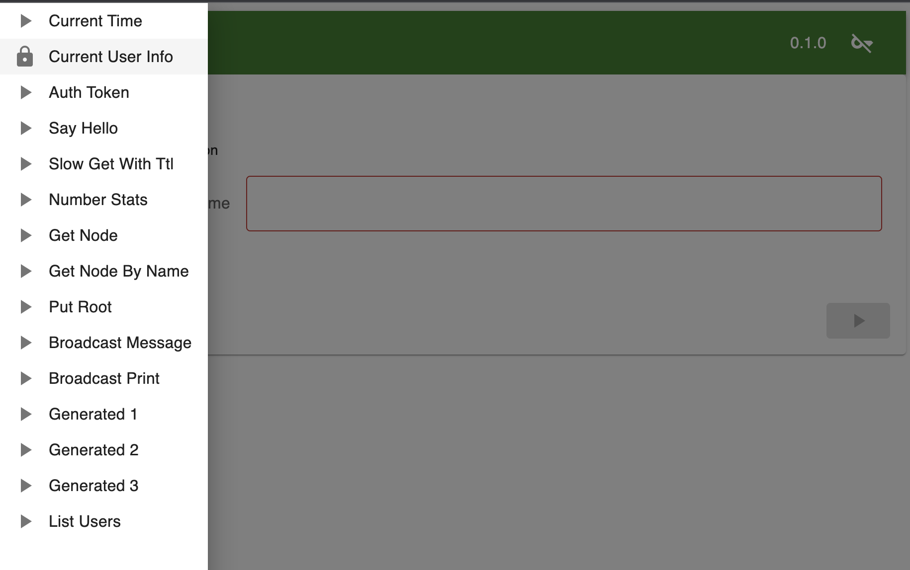

# Ewey - A DRY Approach to building User Interfaces

Ewey (You-ee) is a component oriented user interface framework with the goal of
using the information provided in JSON Schemas as the basis for a UI, with the
ability to fine tune specific sections as required.

Ewey is built on top of:
* [ReactJs](https://react.dev/)
* [I18Next](https://react.i18next.com/)
* [Material UI](https://mui.com/core/)
* [React Query](https://tanstack.com/query/v3/).

## Installation

`npm install ewey --save`

## Example 1: A Simple Component based on a JSON Schema

The example below demonstrates creating a component for displaying a user
from a JSON schema:

```
import { useState } from "react"
import { JsonSchemaFieldFactory } from "ewey";

const myJsonSchema = {
  name: "User",
  type: "object",
  properties: {
    email: {type: "string", format: "email"},
    name: {type: "string", maxLength: 255},
    address: {type: "string"},
    member: {type: "boolean"}
  }
};

const MyComponent = JsonSchemaFieldFactory(myJsonSchema);

function App() {
  const [user, setUser] = useState({
    email: "some@user.com",
    name: "Some User",
    address: "123 Fake Street,\nSometown, Some Country",
    member: true
  })

  return (
    <div className="App">
      <MyComponent value={user} onSetValue={setUser} />
    </div>
  );
}

export default App;

```

This results in the following form...


Which is responsive to different screen sizes...


And internationalizable using i18next ([You will need to add an i18n.ts file
with translations for name, email, address and
member](https://react.i18next.com/guides/quick-start))...


Omitting `onSetValue` yields a static display element instead of a form:


## Example 2: Customizing your Component

Imagine the automatically produced component does not quite meet your needs -
the `Member` checkbox should be a select dropdown with values 'Yes' / 'No'.
Internally, Ewey uses a collection of
[Factory Objects](src/lib/ewey/eweyFactory/EweyFactory.ts) to produce Components based
on schemas. Factories are placed in an array sorted by descending priority.
The `create` method is called for each factory against a schema / subschema,
which will either return a component or null. Once a component is created,
it is returned. [The default factories are specified
here](src/lib/ewey/eweyFactory/index.ts).

So to customize our field, we need a factory with a higher priority than the
default ones that will produce a component for the circumstances we require:

```
import { useState } from "react"
import { useTranslation } from "react-i18next";
import MenuItem from "@mui/material/MenuItem";
import Select from "@mui/material/Select";
import { JsonSchemaFieldFactory } from "./lib/ewey";
import EweyFactory from "./lib/ewey/eweyFactory/EweyFactory";
import { FACTORIES } from "./lib/ewey/eweyFactory";
import { AnySchemaObject } from "./lib/ewey/schemaCompiler";
import EweyProps from "./lib/ewey/eweyField/EweyProps";
import { Components } from "./lib/eweyFactory/Components";

const myJsonSchema = {
  name: "User",
  type: "object",
  properties: {
    email: {type: "string", format: "email"},
    name: {type: "string", maxLength: 255},
    address: {type: "string"},
    member: {type: "boolean"}
  }
};

// We define a custom select component
function MySelect({value, onSetValue} : EweyProps<boolean>) {
  const { t } = useTranslation()
  const valueStr = value ? 'yes' : ''
  return (
    <Select
      value={valueStr}
      fullWidth
      disabled={!onSetValue}
      onChange={onSetValue ? (event => onSetValue(!!event.target.value)) : undefined}
    >
      <MenuItem value={''}>{t('No')}</MenuItem>
      <MenuItem value={'yes'}>{t('Yes')}</MenuItem>
    </Select>
  )
}

// We define our own Factory for boolean schema components, with a higher priority than the existing factories
class MyFactory implements EweyFactory {
  priority: number = 200;

  create(
    schema: AnySchemaObject,
    components: Components,
    currentPath: string[],
    factories: EweyFactory[],
  ) {
    if (schema?.type !== "boolean") {
      return null;
    }
    return MySelect;
  }
}

// When creating our component, we include our custom factory
const myFactories = [...FACTORIES, new MyFactory()]
const MyComponent = JsonSchemaFieldFactory(myJsonSchema, {}, [], myFactories);

function App() {
  const [user, setUser] = useState({
    email: "some@user.com",
    name: "Some User",
    address: "123 Fake Street,\nSometown, Some Country",
    member: true
  })

  return (
    <div className="App">
      <MyComponent value={user} onSetValue={setUser} />
    </div>
  );
}

export default App

```




## Example 3: Using OpenApi

Frameworks like [Servey](https://github.com/tofarr/servey) produce OpenApi
specifications for your server side API. Ewey can then be used to rapidly create
user interfaces for these APIs.


### [OpenApiProvider](src/lib/ewey/openApi/OpenApiProvider.tsx)

Loads an OpenApi Schema and stores it in a react context for use by child
components:
```
import { OpenApiProvider } from 'ewey';

<OpenApiProvider url="/my-open-api/openapi.json">
  ...
</OpenApiContext.Provider>
```

You can also use the `OpenApiContext.Provider` to reference statically included
schemas:
```
import { OpenApiContext } from 'ewey';

const myOpenApiSchema = ...

<OpenApiContext.Provider value={myOpenApiSchema}>
  ...
</OpenApiContext.Provider>
```


### [OpenApiForm](src/lib/ewey/openApi/OpenApiForm.tsx)

Creates a form for an operation within an OpenApi schema. For example, if you
have an OpenApi server running on localhost:8000 which defines a `say_hello`
operation, you can create a UI with:

```
import { QueryClient, QueryClientProvider } from "@tanstack/react-query";
import { OpenApiProvider, OpenApiForm } from "./lib/ewey";

const queryClient = new QueryClient();

function App() {
  return (
    <div className="App">
      <QueryClientProvider client={queryClient}>
        <OpenApiProvider url="http://localhost:8000/openapi.json">
          <OpenApiForm operationId="say_hello" onSuccess={alert}/>
        </OpenApiProvider>
      </QueryClientProvider>
    </div>
  )
}

export default App;
```



## [OpenApiQuery](src/lib/ewey/openApi/OpenApiQuery.tsx)

Similar to a form, but run a query using react query and display the results:

```
import { QueryClient, QueryClientProvider } from "@tanstack/react-query";
import { OpenApiProvider, OpenApiQuery } from "./lib/ewey";

const queryClient = new QueryClient();

function App() {
  return (
    <div className="App">
      <QueryClientProvider client={queryClient}>
        <OpenApiProvider url="http://localhost:8000/openapi.json">
          <OpenApiQuery operationId="list_users" />
        </OpenApiProvider>
      </QueryClientProvider>
    </div>
  )
}

export default App;
```



## [OpenApiSummary](src/lib/ewey/openApi/OpenApiSummary.tsx)

This is most likely to be useful as a development / debugging tool - Create a
component which summarizes all operations available within an OpenApi schema.

It uses react-router-dom to put the current operation in the browser path:

[App.tsx](src/App.tsx)

(Examples pictured using the servey example app)




